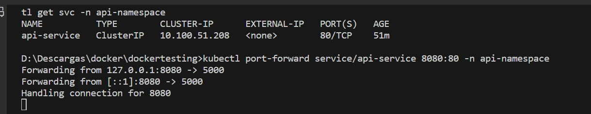
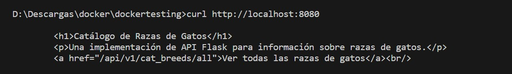

# DockerTesting

Este proyecto consiste en una implementación de una API REST sencilla utilizando Flask en Docker, con soporte para una base de datos MongoDB.

## Descripción

El proyecto consiste en una aplicación web sencilla desarrollada con Flask, un framework de Python para construir aplicaciones web. La aplicación puede ser empaquetada dentro de un contenedor Docker y gestionada utilizando Kubernetes.

La aplicación Flask implementa una API básica que responde a las solicitudes HTTP con un mensaje de saludo. Esta API puede ser accedida mediante una solicitud HTTP GET al endpoint raíz /.

Para facilitar la ejecución y gestión de la aplicación, se proporcionan archivos de configuración para Kubernetes en los directorios app y db. Estos archivos permiten desplegar la aplicación y la base de datos en un clúster de Kubernetes de manera sencilla.

El objetivo principal del proyecto es demostrar cómo utilizar Flask junto con Docker y Kubernetes para desarrollar, empaquetar y desplegar aplicaciones web de manera eficiente y escalable.

## Instalación

1. Clona este repositorio en tu máquina local:

   ```bash
   git clone https://github.com/Snstrike/dockertesting
   ```
2. Descarga la imagen de Docker desde Docker Hub:

   ```bash
   docker pull ferolmos17/dockertesting-api:1.0
   ```
3. Inicia el contenedor Docker con el siguiente comando:

   ```bash
   docker run -d -p 5000:5000 ferolmos17/dockertesting-api:1.0
   ```
4. Iniciar Kubernetes

   ```bash
   minikube start
   ```
5. Crear los espacios de nombres necesarios

   ```bash
   kubectl create namespace api-namespace
   kubectl create namespace db-namespace
   ```
6. Aplicar los archivos de configuración para el despliegue de la aplicación

   ```bash
   kubectl apply -f app/deployment.yml
   kubectl apply -f app/service.yml
   ```
7. Aplicar el archivo de configuración para el despliegue de la base de datos

   ```bash
   kubectl apply -f db/deployment.yml
   ```
8. Verificar que los pods y servicios estén en ejecución

   ```bash
   kubectl get pods -n api-namespace
   kubectl get pods -n db-namespace
   kubectl get services -n api-namespace
   ```
9. Configurar el reenvío de puertos para acceder al servicio de la API

   ```bash
   kubectl port-forward service/api-service 8080:80 -n api-namespace
   ```
10. Realizar una solicitud curl para probar la API

    ```bash
    curl http://localhost:8080
    ```

## Evidencias



## Tecnologías Utilizadas

- Python
- Flask
- MongoDB
- Docker
- Kubernetes
